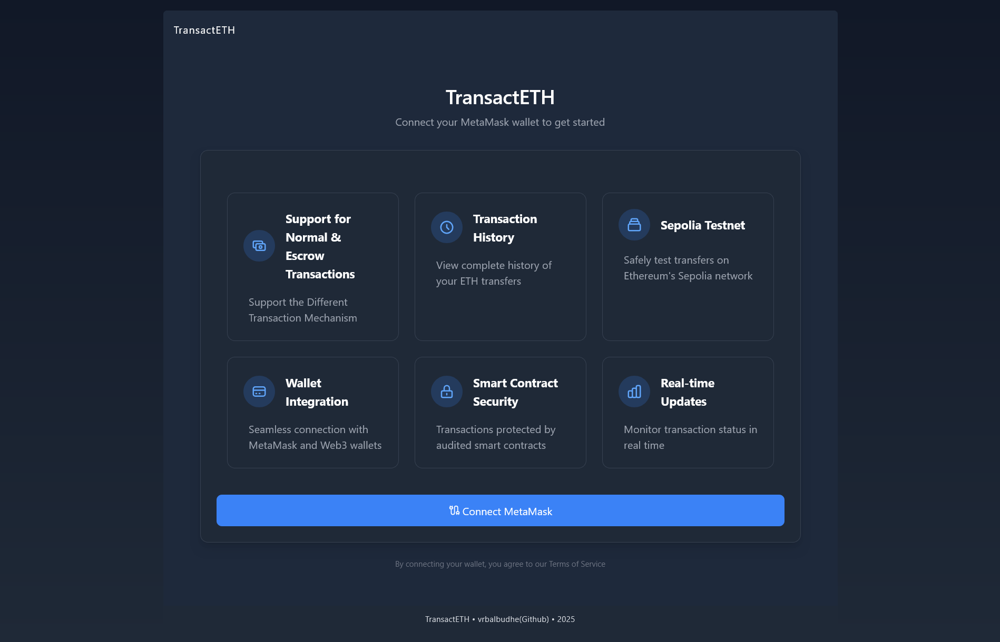
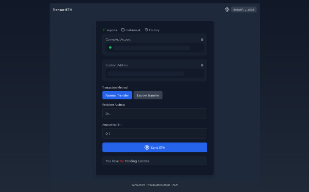
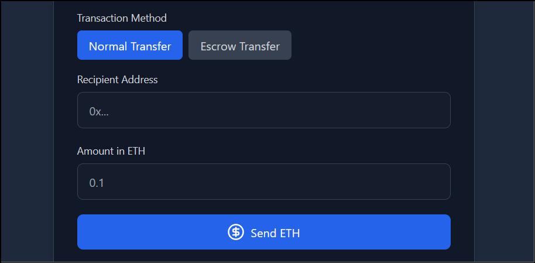
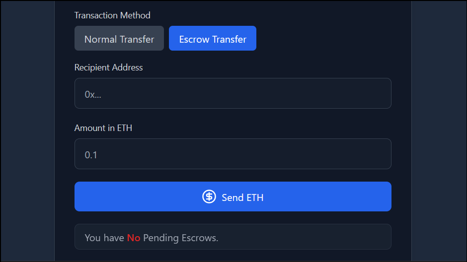
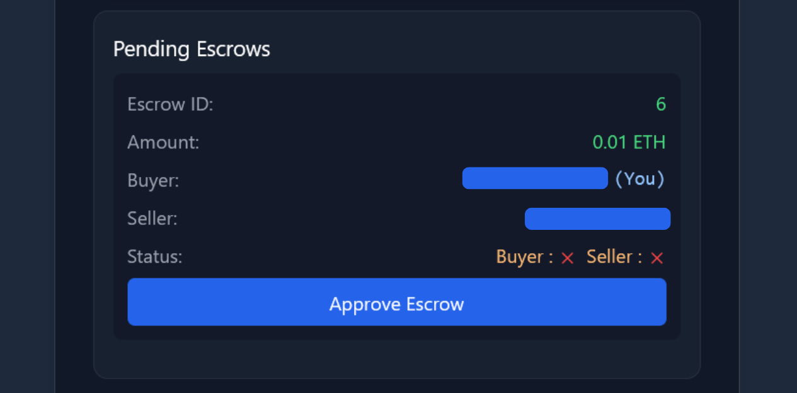
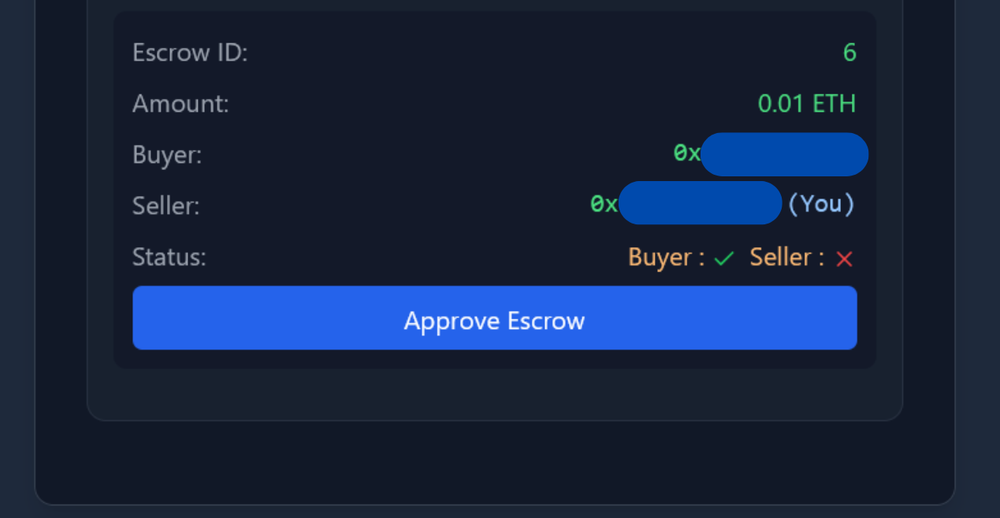
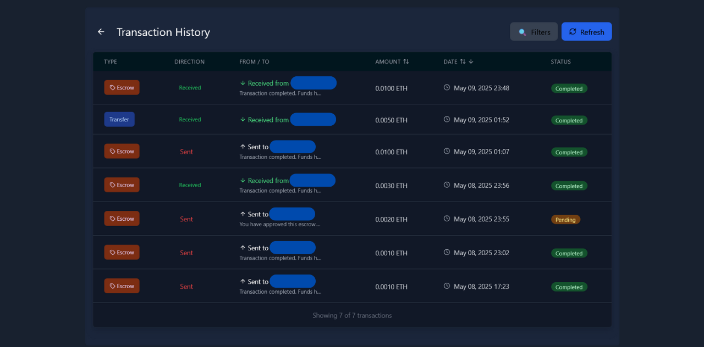
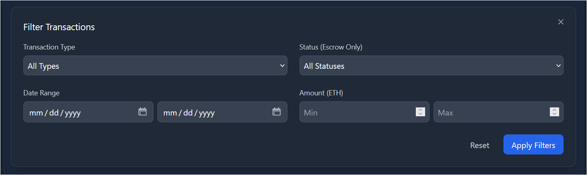

# TransactETH

> A decentralized application for managing Ethereum transactions between accounts with both direct transfers and escrow-protected transfers on the Sepolia testnet.





## 📋 Overview

TransactETH is a comprehensive Ethereum transaction management platform that enables secure direct transfers and escrow-protected transactions. Built for the Sepolia testnet, it provides a safe environment to test Ethereum transfers with complete transaction history tracking and Web3 wallet integration.

## ✨ Key Features

- **Direct ETH Transfer** — Securely send ETH directly between Ethereum addresses
- **Escrow Protection** — Use a secure escrow contract for conditional transfers
- **Transaction History** — View complete history of transfers for your address
- **Sepolia Testnet Compatible** — Safely test all functionalities on Ethereum's Sepolia testnet
- **Web3 Integration** — Seamless connection with MetaMask and other Web3 wallets

## 🛠️ Technologies

```
• Blockchain: Ethereum (Sepolia Testnet)
• Smart Contracts: Solidity
• Frontend: React.js (VITE), Web3.js
• Testing: Foundry, ERC-2335: BLS12-381
• Development Environment: Foundry
• Monitor: Alchemy Dashboard
```

## 📝 Prerequisites

- Node.js (v16+ recommended)
- WSL (Recommended)
- npm or Yarn
- Forgery Build
- MetaMask browser extension
- Some Sepolia ETH (obtainable from faucets)

> ⚠️ **SECURITY WARNING**: DO NOT USE .ENV FOR SECRETS. USE ERC-2335: BLS12-381 INSTEAD.

## 🚀 Usage Guide

### Direct ETH Transfer

1. Connect your MetaMask account to the application
2. Select "Normal Transaction" from the transaction type options
3. Enter the recipient's Ethereum address
4. Specify the ETH amount (e.g., 0.01 ETH)
5. Click "Send Transaction" to initiate the transfer
6. Approve the transaction in MetaMask when prompted
7. View transaction details upon successful completion



### Escrow Transfer

1. Connect your MetaMask account to the application
2. Select "Escrow Transaction" from the transaction type options
3. Enter the recipient's Ethereum address
4. Specify the ETH amount to be held in escrow
5. Click "Send Transaction" and approve in MetaMask
6. Monitor the pending transaction status



### Approving an Escrow (Sender Side)

1. After creating the escrow, a pending approval dialog will appear
2. Click on "Approve Escrow" to proceed
3. Confirm the approval in MetaMask
4. Wait for the recipient's approval



### Finalizing an Escrow (Recipient Side)

1. The recipient will see a pending escrow notification
2. Click "Approve Escrow" to accept the transfer
3. Confirm the approval in MetaMask
4. The transaction will complete once both parties approve



### Transaction History

The History section provides detailed information about all your transactions:

- Complete transaction details including status, amount, and timestamps
- Direct links to Sepolia Etherscan for each transaction
- Filtering capabilities to organize transaction data




## 📊 Alchemy Dashboard Integration

TransactETH leverages Alchemy's powerful dashboard to monitor all blockchain interactions in real-time. This integration provides comprehensive analytics and insights into your dApp's performance.


Key monitoring features include:

- **Network Traffic Analysis** — Track HTTP request counts across the Sepolia testnet
- **Method Usage Metrics** — Monitor which Ethereum methods are most frequently called
- **Performance Insights** — Identify traffic spikes and optimize for better user experience
- **Error Tracking** — Quickly detect and resolve issues with failed requests
- **API Usage Management** — Stay within usage limits and plan for scaling

The dashboard shows valuable data like transaction counts, gas usage, and method popularity, helping developers optimize contract interactions and frontend performance.

## 📊 Smart Contracts

The project implements two primary smart contracts:

### 1. Transaction Contract

Handles standard ETH transfers between addresses with:

- Real-time ETH transfer with success verification
- Comprehensive transaction history tracking for both sender and receiver
- Detailed transaction data storage (sender, receiver, amount, timestamp)
- Event emission for frontend synchronization and blockchain traceability

```solidity
// Key functions:
function makeTransaction(address payable receiver) public payable
function getTransactions(address user) public view returns (TransactionData[] memory)
function getTransactionCount(address user) public view returns (uint256)
```

### 2. Escrow Contract

Manages secure escrow-based transfers with features:

- Multi-party approval system requiring consent from both buyer and seller
- State-based transaction flow (Pending → Approved → Completed)
- Secure fund storage during transaction negotiations
- Automatic fund release upon mutual approval

```solidity
// Key functions:
function createEscrow(address _seller) external payable returns (uint256)
function approve(uint _id) external
```

## 📁 Project Structure

```
contracts/
├── .github/
├── broadcast/
├── cache/
├── lib/
├── out/
├── script/
│   ├── Escrow.s.sol
│   └── Transaction.s.sol
├── src/
│   ├── Escrow.sol
│   └── Transaction.sol
├── test/
│   ├── Escrow.t.sol
│   └── Transaction.t.sol
├── .env
├── .gitignore
├── .gitmodules
├── foundry.toml
└── README.md
```

## 🔒 Security Considerations

- Consider getting a professional audit before deploying to mainnet
- Do not use .env files for storing sensitive information like private keys
- Never push secret credentials to GitHub or any public repository
- Implement ERC-2335: BLS12-381 for secure key management

## 🔮 Future Scope

- Multi-signature escrow capabilities
- Scheduled transactions implementation
- Integration with additional ERC20 tokens
- Mobile application version
- Advanced analytics dashboard
- Gas optimization improvements

## 🤝 Contributing

Contributions are welcome! Please follow these steps:

1. Fork the repository
2. Create your feature branch (`git checkout -b feature/amazing-feature`)
3. Commit your changes (`git commit -m 'Add some amazing feature'`)
4. Push to the branch (`git push origin feature/amazing-feature`)
5. Open a Pull Request

## 📄 License

This project is licensed under the MIT License - see the LICENSE file for details.

## 👏 Acknowledgments

- Ethereum Foundation
- Sepolia Testnet team
- OpenZeppelin for security patterns
- The Web3 community

---

> **Note**: This project is currently using the Sepolia testnet. Do not send real ETH to these contract addresses.
