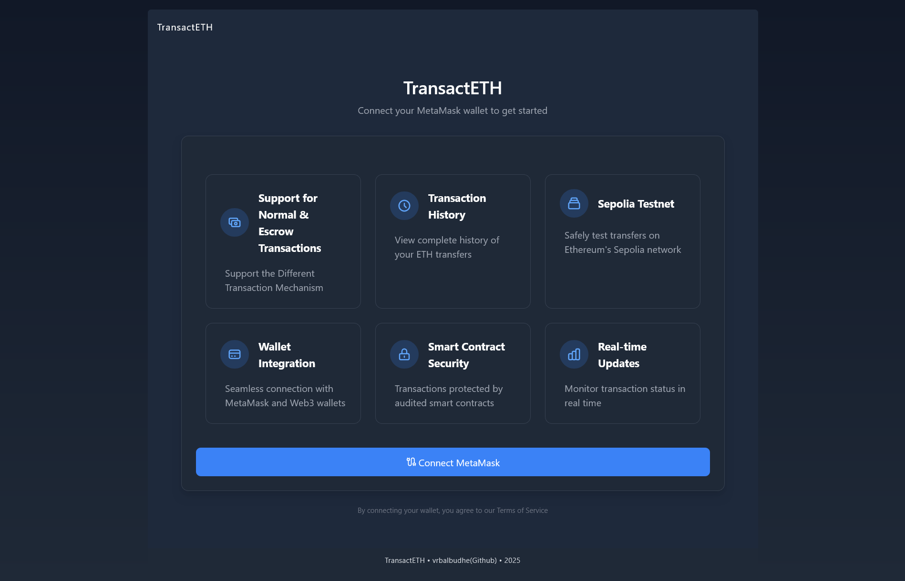
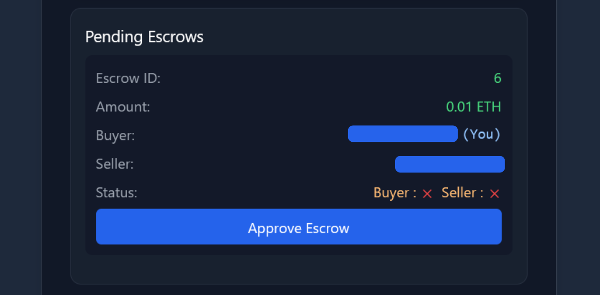
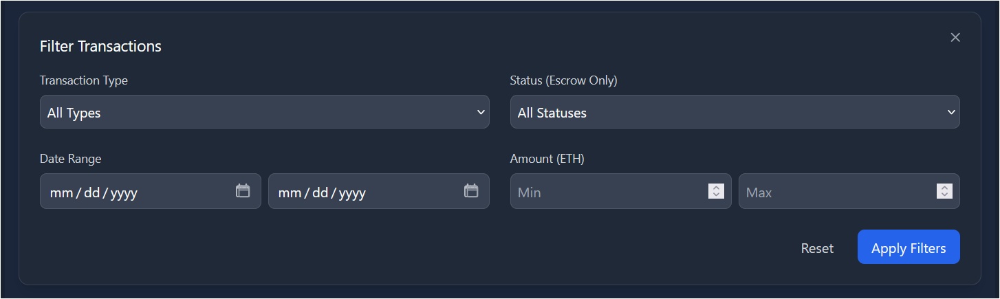

# TransactETH

A decentralized application for managing Ethereum transactions between accounts with both direct transfers and escrow-protected transfers on the Sepolia testnet.



## Features Showcase

- **Direct ETH Transfer**: Securely send ETH directly between Ethereum addresses
- **Escrow Protection**: Use a secure escrow contract for conditional transfers
- **Transaction History**: View complete history of transfers for your address
- **Sepolia Testnet Compatible**: Safely test all functionalities on Ethereum's Sepolia testnet
- **Web3 Integration**: Seamless connection with MetaMask and other Web3 wallets

## Technologies Used

```
- Blockchain: Ethereum (Sepolia Testnet)
- Smart Contracts: Solidity
- Frontend: React.js, Web3.js
- Testing: Foundry, ERC-2335: BLS12-381
- Development Environment: Foundry
```

## Features

1. Normal Eth Transaction
   

```txt
### Steps
1. Enter the Recipent Address & Amount in ETH
2. And Click on the Send ETH
3. Metamask Extension Will PopUp and Will Ask for the Confirmations.
4. Confirm, it
5. And Done, Enjoy the Process Until the Transaction is Completed.
```


2. Escrow Eth Transaction
   

```
### Steps
1. Enter the Recipent Address & Amount in ETH
2. And Click on the Send ETH
3. Metamask Extension Will PopUp and Will Ask for the Confirmations.
4. Confirm, it
5. And Done, Enjoy the Process Until the Transaction is Completed.
```


```
6. After Completion the Pop-up will be displayed on the bottom displaying the Pending Escrow Confirmation Box.
```



```
7. Click on the [Approve Escrow] Button and Metamask will be pop up, confirm it and Wait for the Buyer Approval.
```


```
8. Now Since, it is confirmed on the Buyer Side, Now It Requires the Seller's Approval.
9. On Recipent's Side, The Pending Escrow Payment Box Will Be Displayed asking for the Approval.
```


```
10. Click on, Approve Escrow
11. The Metamask Will be pop-up asking for the confirmations, confirm it.
12. After Successfully Done, We Can see the confirmation in the History Section.
```


3. History Section & Information Filter
```
> This Page Contains the Detailed Information About the Perticular Transaction and also redirects to the sepolia.etherscan.
```


```
> It Also Consists of the Filter Component That Filters The Transaction Data Based on the different Parameters.
```



## Security Considerations

- Consider getting a professional audit before deploying to mainnet
- Don't Use the .env for the Secrets like Account PrivateKey
- Dont't Push Any Secret Credintials on the Github.

## Future Improvements

- Multi-signature escrow capabilities
- Implementing the scheduled transactions
- Integration with additional ERC20 tokens
- Mobile application version
- Advanced analytics dashboard
- Gas optimization improvements

## Contributing

Contributions are welcome! Please feel free to submit a Pull Request.

1. Fork the repository
2. Create your feature branch (`git checkout -b feature/amazing-feature`)
3. Commit your changes (`git commit -m 'Add some amazing feature'`)
4. Push to the branch (`git push origin feature/amazing-feature`)
5. Open a Pull Request

## License

This project is licensed under the MIT License - see the LICENSE file for details.

## Acknowledgments

- Ethereum Foundation
- Sepolia Testnet team
- OpenZeppelin for security patterns
- The Web3 community

---

_Note: This project is currently using the Sepolia testnet. Do not send real ETH to these contract addresses._
